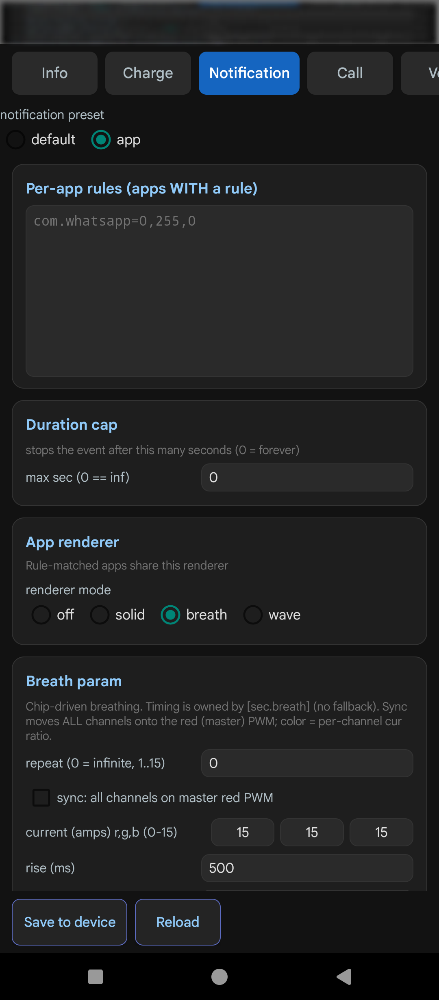
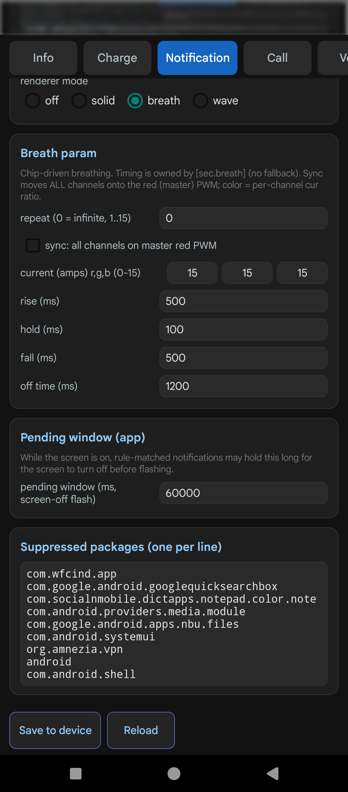
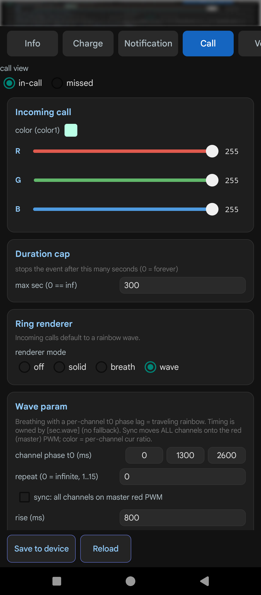
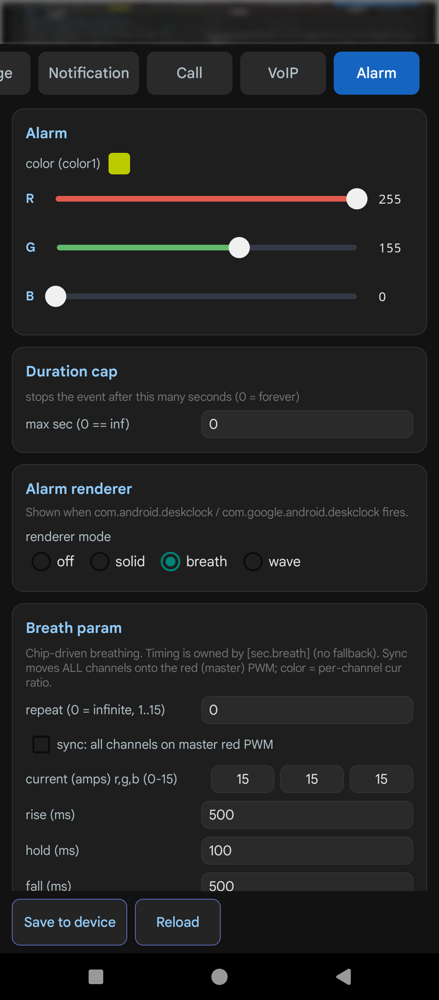

# led_hal_root - Notification LED daemon for Blackview Shark 8

KernelSU module that drives the AW2033 RGB notification/charge LED on a
rooted Blackview Shark 8 running a ported Pixel GSI ROM. A single
event-driven daemon (`chgd`) programs the chip.

Both companion apps ship inside the flashable zip, but only one of them
is this project's:

- **NotifyBridge** (`notifybridge-release.apk`, `com.bastet.notifybridge`) - the required headless
  notification bridge. It is a **standalone project** - the
  [android-notify-bridge](https://github.com/nalbe/android-notify-bridge) repo;
  this repo only consumes its `notifybridge-release.apk` artifact.
- **LED GUI** (`led_gui-release.apk`, `com.bastet.ledgui`) - the optional
  configurator. **This** project's app, lives here under `led_gui/`.

The AW2033 chip controller is also external: the packed `libaw2033.a` +
`aw2033.h` in `lib/` are the only pieces of the standalone
[aw2033-driver](https://github.com/nalbe/aw2033-driver) repo that this
project ships (the chip driver and the `awctl` CLI are built there).

## What is in this repo

```
led_hal_root/   daemon core only (C sources, mods/, build.cmd) -> chgd
led_gui/        optional configurator app (com.bastet.ledgui)
module/         module packaging: customize.sh, service.sh, module.prop,
                led.conf, META-INF, awctl prebuilt,
                notifybridge-release.apk (from android-notify-bridge) + led_gui-release.apk
release/        flashable zip output (led_hal_root-v<ver>.zip)
lib/            libaw2033.a + aw2033.h ONLY (prebuilt chip controller)
```

Build scripts: `build_module.cmd` (full release), `build.cmd` (chgd
only), `install_core.cmd` (build + deploy to device), `install_gui.cmd`
(build GUI app), `install_nls.cmd` (consume the notify-bridge notifybridge-release.apk).

## Install

1. Download [`led_hal_root-v3.6.zip`](https://github.com/nalbe/shark8-led-daemon/releases/latest) (flashable KernelSU module)
2. Flash in KernelSU Manager -> Modules -> Install from storage
3. `customize.sh` installs both apps automatically (`pm install -r`,
   non-fatal on failure):
   - **NotifyBridge** - required for the notification/call/VoIP/alarm LEDs
   - **LED GUI** - optional configurator
4. Grant **NotifyBridge** Notification access (Settings -> Special app access
   -> Notification access -> NotifyBridge). LED GUI additionally needs root
   (KernelSU Manager) for its status/config screen.
5. Reboot

The `led.conf` shipped inside the module is canonical and is **always
overwritten** on every module install/update - if you customised it, keep
your edits in the repo copy, or use the GUI (which saves edits straight to
the live config file).

## The daemon

Everything animates inside the AW2033 chip; chgd only programs registers.
Screen state (and hence most wakeups) comes only from the bridge over the
socket - the daemon reads no sysfs and owns no screen polling; it is
asleep in idle.

### Events and renderers

Any event can use any hardware renderer. Each event owns its own
`[section]` in `led.conf` with `mode=off|solid|breath|wave`, and each
renderer's chip tuning lives in its own `[section.solid]`,
`[section.breath]`, `[section.wave]` sub-sections - per-channel current
(`cur`), `rise/hold/fall/offt` timing, breath repeat count and the wave
phase offsets `t0=r,g,b` (the staggering that produces the traveling
rainbow). Timing is owned by the chip sections;

Events:

- **charge** - three bands (lower/middle/upper), each with its own
  renderer, thresholds in `[charge]` (`first_threshold` /
  `second_threshold`, order-free). The band is evaluated from the
  bridge's `CHG <status> <level> [<plugged>]` command - the broadcast
  fires on every real status/level/plug change, so a threshold crossing
  repaints immediately (no uevent gap, no recheck). It is re-rendered
  on SIGALRM/inotify (config edit) from the last bridge state. The
  optional plugged bit gates the band: `plugged=0` (broadcast says no
  source is attached) forces "none".
- **notification** - two presets: `[notify]` for apps without a rule,
  `[notify.app]` for apps that have a `[rules]` color entry
- **ring** - SIM/dialer calls, incoming and outgoing
- **voip** - messenger calls (any app the bridge classifies as a call
  notification - category CALL / call channel)
- **missed** - missed-call LED (bridge event `MISSED_ON`/`MISSED_OFF`).
  The missed tombstone is the dialer's own notification, so it obeys the
  system "Blink light" toggle like the generic pool (unlike live calls)
- **alarm** - alarm clock LED

Every one accepts any of the four renderers and its own color, timing,
current and caps. Colors, thresholds, renderer modes, chip timings,
per-channel current, caps and the suppress blacklist are all user-editable
in `led.conf` - no rebuild. The root daemon watches its config directory
with inotify and reloads on any write; the GUI's SIGALRM poke is an
explicit extra trigger feeding the same reload flag. Edits apply on the
next processed event.

### Notification pipeline

Notifications enter an in-memory priority pool (`mods/queue.c`, up to 32
entries); a single arbitrator decides who lights the LED, when, and for
how long. No per-entry timers - the pool is lazy-rechecked only on real
edges (the bridge's screen event, a cancel, or a cap deadline):

- **Selection is LIFO by recency** - the freshest post wins. A newer top
  **preempts** the current entry, which returns to the pool with its shown
  time accrued (`shown_ms`) and resumes from the leftover on its next
  turn, so alternating app traffic cannot blink forever.
- **Lifetime** is `created + [notify(.app)] notif_max_sec` (builtin
  default 1800s; the shipped `led.conf` sets 0 = unlimited). An entry that
  aged out is dropped at pick time; expiry also caps the accumulated show
  time.
- **Screen-on staging needs no timer.** A fresh top that lands on a lit
  screen parks as `Q_HOLD`. The bridge sends `SCREEN 0` the moment the
  screen falls, which flashes the park instantly. If the screen
  stays up past the grace window (`notify_screen_delay_ms`, default
  60000) the parked top is dropped - and only it. 
- **Calls, alarms, missed and VoIP are untouchable planes.** While
  ring/voip/missed or alarm own the channel, the pool simply waits - it
  keeps accumulating, times still tick, and stale entries are dropped
  lazily. A notification backlog can never light the LED mid-call or
  override an alarm.
- **Cadence is reactive.** The core timer is armed to the next real
  deadline: exactly at the active entry's cap, a single `WATCHDOG_SEC`
  safety pass when there is no cap at all (`notif_max_sec=0`), and idle
  work. Screen state exists only as the bridge's `SCREEN` events.

### Notification transport

The daemon talks only to the standalone headless **NotifyBridge** app over
the abstract Unix socket `notify_bus`. The bridge config needed by the
module rides inside the zip as `module/notifybridge.json`
(`/data/local/tmp/notifybridge.json` on the device - deployed by
`customize.sh` on flash and `install_core.cmd` on dev-apply, always
overwritten like `led.conf`): the ENQ/CAN/RING/VOIP/MISSED/SCREEN/PULSE rule set
plus the `notification_light_pulse` setting watcher that powers the
blink-light gate. Call classification runs on any package by bridge
markers (category CALL / call channel / answer-decline actions) - the
config routes each package to `RING_*` (telephony dialers) or
`VOIP_*` (messengers) with one `call.on`/`call.off` pair per package,
so a live call from an unlisted package sends nothing to the bus. The
full rule language is configurable - see the
notify-bridge repo. The wire format the daemon expects:

```
ENQ <pkg> <id>        notification posted        -> pool push
CAN <pkg> <id>        notification removed       -> pool entry gone
CAN_ALL <pkg>         app cleared its posts
RING_ON <0|1>         SIM call (1=incoming)      -> call plane
RING_OFF              last SIM call notification
VOIP_ON <pkg>         messenger call             -> voip plane
VOIP_OFF <pkg>        messenger call notification gone
MISSED_ON <id>        dialer missed-call tombstone posted -> missed plane
MISSED_OFF <id>       dialer missed-call tombstone gone
SCREEN <0|1>          screen off/on              -> park flash / grace
CHG <status> <level> [<plugged>]
                      battery broadcast          -> charge band (only
                      charge input; status word or raw BatteryManager
                      int 2=Charging..5=Full, level 0..100, optional
                      plugged bit, 0 forces the band off)
PULSE <0|1>           notification_light_pulse changed by any writer
                        (ONLY source of the toggle state - the daemon
                        never reads Settings.* itself)
```

On connect the client **replays its live state** (SCREEN, watched
settings like PULSE, active RING/VOIP/MISSED, every active ENQ), so a
daemon restart mid-call re-arms cleanly and the blink-light toggle needs no
local read: the bridge forwards its current polarity on connect the
same way it does screen (and forwards every real change instantly).
Battery state rides the broadcast the same way: the sticky
ACTION_BATTERY_CHANGED delivers the current status/level/plugged on
registration, so a daemon restart repaints the charge band too.
With the bridge absent, no notification-side LED can light. Charge bands,
the light-pulse gate and the test hooks are daemon-side and unaffected.

### System gates

- **"Blink light" toggle** (Settings -> Notifications -> Blink light):
  when off, the daemon drops all notification LEDs (generic pool plus the
  missed-call LED - the dialer's tombstone is a notification too) while
  call rainbows, alarms and charge are unaffected. The bridge watches
  `Settings.System` with a `ContentObserver` and pokes `PULSE 0` the
  moment any writer changes it, so a running notification LED goes off
  instantly. The pull side is pure state: `pulse_note()` stores the
  NLS value (with the connect replay covering restarts) and the
  next arming reads it.
  `customize.sh` turns the toggle on for fresh installs.

## LED GUI - optional configurator

The daemon + NotifyBridge work fine without it. The GUI is a Kotlin/Android
Views app with a follow-the-finger swipe pager and six tabs:

- **Info** - root status (persistent explainer when su is hidden / "Open
  KernelSU Manager" button), daemon PID, bridge connect state (reads
  `notifybridge.status`) + one-tap Notification access grant, live LED swatch
  with the active renderer/engine and chip imax,
  test hooks (fake Telegram / call / VoIP / alarm / Charge cycle /
  Disarm), log tail with the `[led] logging` toggle
- **Charge** - thresholds (`[charge]` first/second) + one renderer card
  per band (LOW/MID/HIGH): mode, color, per-channel current,
  breathing/wave timing
- **Notification** - the two presets, each fully editable: **default**
  (`[notify]`, apps without a rule) and **app** (`[notify.app]`,
  rule-matched apps share this renderer; per-app colors live in the
  `pkg=r,g,b` `[rules]` list + suppressed packages, one per line)
- **Call** - two views: **in-call** (`[ring]` renderer, max cap,
  color/timing) and **missed** (`[missed]` LED, max cap, color/timing)
- **VoIP** - `[voip]` renderer and safety cap. Which apps count as a
  messenger call is decided by the bridge (category CALL / call channel),
  mirroring the daemon.
- **Alarm** - `[alarm]` renderer, color, max duration

All changes save to `led.conf` and SIGALRM the daemon - they take effect
on the next daemon event, no restart, no rebuild. Requires root
(KernelSU). Build with `install_gui.cmd` or install the bundled
`led_gui-release.apk`.

### Screenshots

<details>
<summary>Show LED GUI screenshots</summary>

| Info | Charge |
| --- | --- |
|  |  |

| Notification | Notification |
| --- | --- |
|  |  |

| Notification | Call |
| --- | --- |
|  |  |

| VoIP | Alarm |
| --- | --- |
|  |  |

</details>

## Build from source

Requires [Android NDK r27d](https://developer.android.com/ndk/downloads).
Edit `NDK_CC` in `led_hal_root/build.cmd` if your NDK is elsewhere, then
build the flashable module zip in one step from the repo root:

```
build_module.cmd
```

This compiles chgd, merges `led_hal_root/` + `module/` (led.conf,
service.sh, customize.sh, the two APKs, the prebuilt awctl) and writes
`release\led_hal_root-v<version>.zip`.

`led_hal_root/build.cmd` alone builds the daemon binary only: every `*.c`
plus `mods/*.c` linked against the prebuilt chip controller
(`lib/libaw2033.a` + `lib/aw2033.h`).

The chip sources are **not** here - rebuild `libaw2033.a` and `awctl` in
the standalone [aw2033-driver](https://github.com/nalbe/aw2033-driver)
repo and drop the artifacts into `lib/` / `module/awctl`
(`build_module.cmd` packages `module/awctl` as-is, no rebuild). Similarly,
the NotifyBridge app builds in the standalone
[android-notify-bridge](https://github.com/nalbe/android-notify-bridge) repo;
`install_nls.cmd` only copies its `notifybridge-release.apk` to
`module/notifybridge-release.apk`.

## Deploy

With the device connected and `adb root` working:

```
install_core.cmd
```

This rebuilds, pushes all module files, and restarts the daemon.

## Test hooks

```bash
kill -USR1 $(pidof chgd)   # fake Telegram notification (test mode, ignores screen)
kill -HUP  $(pidof chgd)   # test INCOMING call (renderer held until Disarm / [ring] max_sec)
kill -WINCH $(pidof chgd)  # test VoIP call (messenger rainbow, held until Disarm / [voip] max_sec)
kill -TSTP $(pidof chgd)   # test ALARM ([alarm] renderer, preempts whatever owns the channel)
kill -PWR  $(pidof chgd)   # test MISSED call (same path as the bridge's MISSED_ON event)
kill -QUIT  $(pidof chgd)  # cycle charge bands: lower -> middle -> upper -> none
kill -USR2  $(pidof chgd)  # Disarm: kill the armed LED + clear the pool
                            # (does NOT touch the "Blink light" gate state -
                            # that only ever follows the bridge's PULSE events)
kill -CONT  $(pidof chgd)  # truncate /data/local/tmp/ledd.log
kill -ALRM  $(pidof chgd)  # reload kick when the inotify watcher is unavailable (else redundant - edits are auto-detected via inotify)
```

## Status files (world-readable, no su needed on the read side)

- `/data/local/tmp/led_status` - the live LED state: `mode`/`band`/`pkg`/
  `color=`/`engine=`, where `engine` (`off`/`solid`/`breath`/`wave`) tells
  a consumer whether the raw brightness node reflects what the eye sees -
  chip-driven patterns read a constant peak, solid reads the real color.
- `/data/local/tmp/notifybridge.status` - bridge connect state
  (`connected=1|0`), written by the daemon on accept/EOF and after every
  reload.

## Release history

See [PATCHNOTES.md](PATCHNOTES.md) - kept to the daemon core and the GUI
(notify-bridge and aw2033-driver keep their own changelogs).

## Architecture

```
core.c    - main loop: select() over the NLS client socket (and its listen
            socket) and the adaptive one-shot timerfd; NLS command pipeline
            (ENQ/CAN/CAN_ALL, RING_ON/OFF, VOIP_ON/OFF, MISSED_ON/OFF,
            SCREEN, CHG, PULSE); signal test hooks; lockfile
led.c     - per-event renderer adapter: resolves [sec] mode=off|solid|breath|wave
            and programs the AW2033 chip through aw2033.h (the ONLY LED writer;
            ALL ANIMATION RUNS ON CHIP)
config.c  - led.conf parser + generic key-value store for mods
util.c    - logging, file read helper, led_status + notifybridge.status
            files, screen state cache (only the bridge's SCREEN events),
            notification_light_pulse gate (only the bridge's PULSE events)

mods/
  charge.c  - charge band eval ([charge] thresholds only) + per-band renderer
              apply; driven by the bridge's CHG command, refresh repaints
              from the last CHG on boot/SIGALRM;
              plugged=0 forces the band off
  queue.c   - notification priority pool: LIFO pick, screen-on Q_HOLD staging,
              preemption with resume-credit, lazy grace/expiry, cap accrue
  notify.c  - notification gate (suppress -> per-app color -> [notify]/
              [notify.app] renderer), owns the armed channel + pool heartbeat
  ring.c    - SIM call mode (RING_ON/RING_OFF), [ring] renderer. The tombstone
              comes from the bridge as MISSED_ON and missed.c owns it
  missed.c  - missed-call LED, driven purely by the bridge's
              MISSED_ON/MISSED_OFF events
  voip.c    - messenger call mode (VOIP_ON/VOIP_OFF), [voip] renderer,
              safety cap; which apps are calls is decided by the bridge
              (category/channel)
  alarm.c   - alarm clock LED, [alarm] renderer
```

Adding a feature = a new file under `mods/`, no core edits. Extensions use
`REGISTER_RULE` / `REGISTER_HANDLER` / `REGISTER_MODE` /
`REGISTER_MODE_WAKE` / `REGISTER_REFRESH` macros that
place entries into linker sections. `config.c` is a generic key-value
store: every unknown `[section] key=value` in led.conf is readable via
`conf_get_str` / `conf_get_int`, so a mod owns its own config section
without config.c knowing the key exists.


