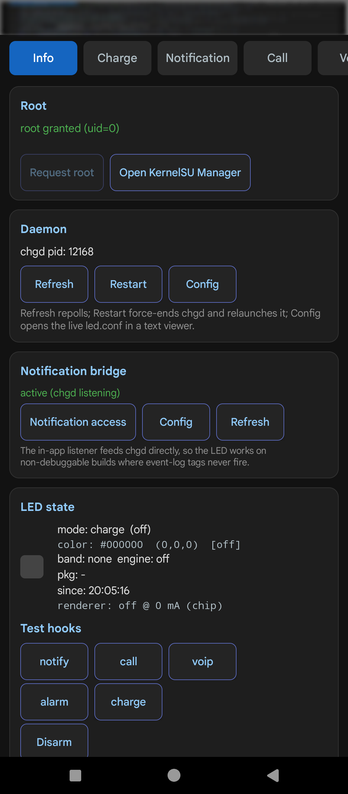
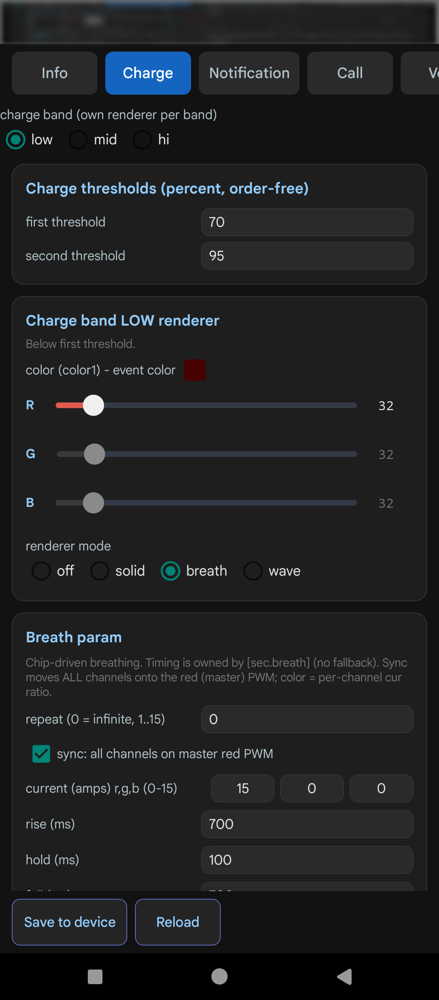
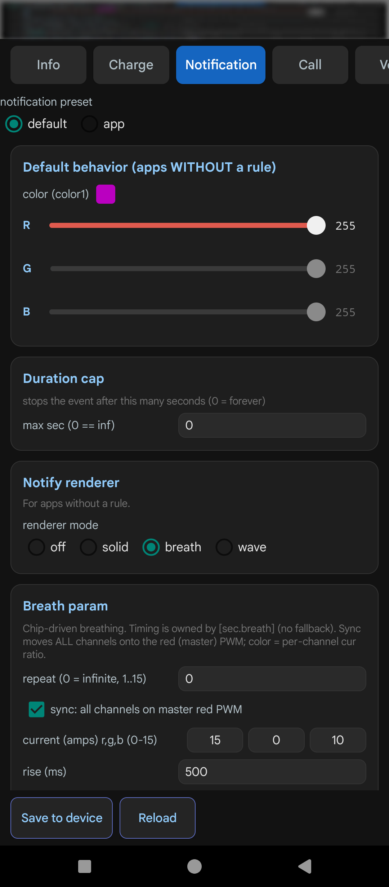
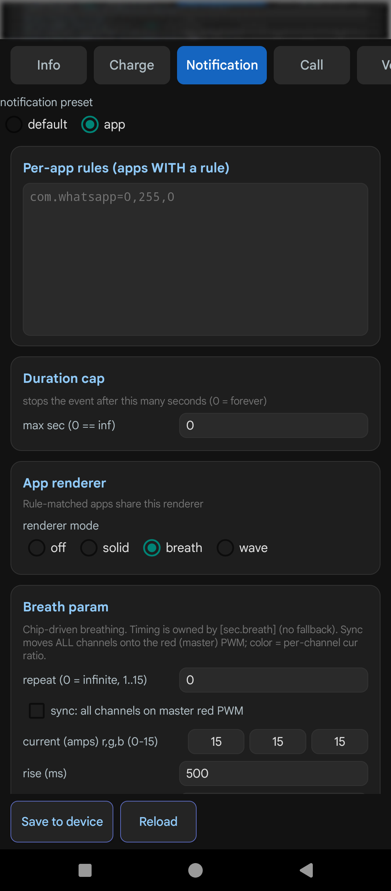
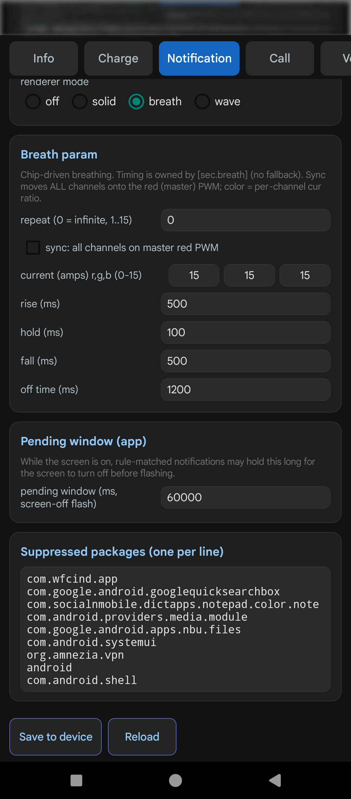
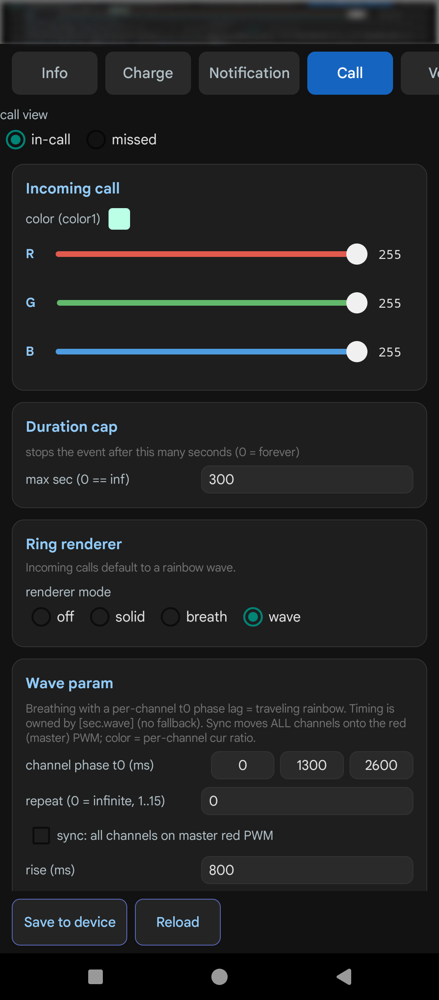
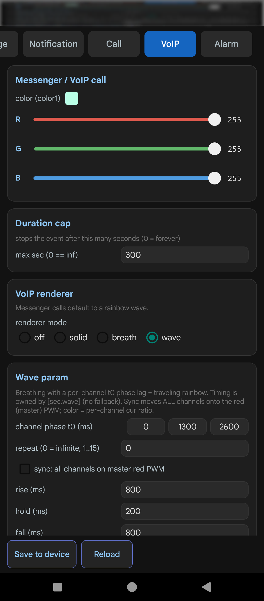
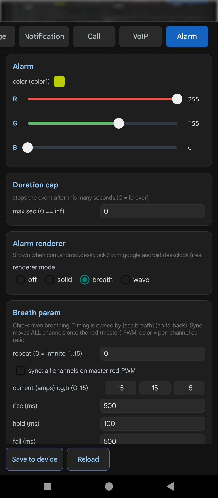

# led_hal_root - Notification LED daemon for Blackview Shark 8

KernelSU module that drives the AW2033 RGB notification/charge LED on a
rooted Blackview Shark 8 running a ported Pixel GSI ROM. A single
event-driven daemon (`chgd`) programs the chip.

Both companion apps ship inside the flashable zip, but only one of them
is this project's:

- **NotifyBridge** (`notifybridge-release.apk`, `com.bastet.notifybridge`) - the required headless
  notification bridge. It is a **standalone project** - the
  [android-notify-bridge](https://github.com/nalbe/android-notify-bridge) repo;
  this repo only consumes its `notifybridge-release.apk` artifact.
- **LED GUI** (`led_gui-release.apk`, `com.bastet.ledgui`) - the optional
  configurator. **This** project's app, lives here under `led_gui/`.

The AW2033 chip controller is also external: the packed `libaw2033.a` +
`aw2033.h` in `lib/` are the only pieces of the standalone
[aw2033-driver](https://github.com/nalbe/aw2033-driver) repo that this
project ships (the chip driver and the `awctl` CLI are built there).

> **breath & wave are not "color + brightness".** They run on the chip's
> per-channel pattern engines that free-run on their own timing, so at
> different PWM/current levels channels drift out of phase - **without
> `sync=1` the mix collapses into cacophony**. Turning `sync=1` on locks
> all three channels to the master (red), but then the rgb PWM you write
> is ignored and color is only the per-channel `cur` ratio - **with sync
> there is no per-channel PWM control**. How to set them up is described
> below under "The daemon" (the render line and its `sync` field in
> `led.conf`).

## What is in this repo

```
led_hal_root/   daemon core only (C sources, mods/, build.cmd) -> chgd
led_gui/        optional configurator app (com.bastet.ledgui)
module/         module packaging: customize.sh, service.sh, module.prop,
                led.conf, META-INF, awctl prebuilt,
                notifybridge-release.apk (from android-notify-bridge) + led_gui-release.apk
release/        flashable zip output (led_hal_root-v<ver>.zip)
lib/            libaw2033.a + aw2033.h ONLY (prebuilt chip controller)
```

Build scripts: `build_module.cmd` (full release), `build.cmd` (chgd
only), `install_core.cmd` (build + deploy to device), `install_gui.cmd`
(build GUI app), `install_nls.cmd` (consume the notify-bridge notifybridge-release.apk).

## Install

1. Download the latest [`led_hal_root-v4.4.zip`](https://github.com/nalbe/shark8-led-daemon/releases/latest) (flashable KernelSU module)
2. Flash in KernelSU Manager -> Modules -> Install from storage
3. `customize.sh` installs both apps automatically (`pm install -r`,
   non-fatal on failure):
   - **NotifyBridge** - required for the notification/call/VoIP/alarm LEDs
   - **LED GUI** - optional configurator
4. Grant **NotifyBridge** Notification access (Settings -> Special app access
   -> Notification access -> NotifyBridge). LED GUI additionally needs root
   (KernelSU Manager) for its status/config screen.
5. Reboot

The `led.conf` shipped inside the module is canonical and is **always
overwritten** on every module install/update - if you customised it, keep
your edits in the repo copy, or use the GUI (which saves edits straight to
the live config file).

## The daemon

Everything animates inside the AW2033 chip; chgd only programs registers.
Screen state (and hence most wakeups) comes only from the bridge over the
socket - the daemon reads no sysfs and owns no screen polling; it is
asleep in idle.

### Events and renderers

Any event can use any hardware renderer. Each event owns its own
`[section]` in `led.conf`, and one `render=` line in it carries the whole
renderer:

```
render=<r,g,b>,<mode>,<cur_r,g,b>,pattern,<sync>,<repeat>,<cur_r,g,b>,<rise>,<hold>,<fall>,<offt>,<t0_r,g,b>
```

`<mode>` is `off|solid|breath|wave`; the current triple right after it
belongs to `solid`, and the block behind the literal `pattern` marker is the
preset breath and wave share: `sync`, `repeat`, the pattern current, the
breathing timing and the wave-only `t0` phase offsets (the staggering that
produces the traveling rainbow). The leading colour is the only place a
colour is written - for `[notify]` it is the colour apps without a
`[rules]` entry paint in.

Every token of the line is **required** - there are no built-in timings,
currents or `sync` defaults left to fall through on. A `render=` line that
cannot be read completely (too few tokens, non-numeric value, unknown
`mode`) logs a `warn:` line naming the offending field and the event is
skipped, leaving the previous LED state alone. Warnings ignore the `[led]
logging` switch, so they survive with routine logging off.

Events:

- **charge** - three bands (lower/middle/upper), each with its own
  renderer, thresholds in `[charge]` (`first_threshold` /
  `second_threshold`, order-free). The band is evaluated from the
  bridge's `CHG <status> <level> [<plugged>]` command - the broadcast
  fires on every real status/level/plug change, so a threshold crossing
  repaints immediately (no uevent gap, no recheck). It is re-rendered
  on SIGALRM/inotify (config edit) from the last bridge state. The
  optional plugged bit gates the band: `plugged=0` (broadcast says no
  source is attached) forces "none". "None" paints the LEDs off through
the charge entry itself, so an unplugged device still has an owner for
   the light.
- **notification** - `[notify]` is the shared preset for apps without a
  rule; a `[rules]` entry with its own cap and preset gets a synthesized
  preset of its own. A colour-only entry resolves to `[notify]` as well
- **ring** - SIM/dialer calls, incoming and outgoing
- **voip** - messenger calls (any app the bridge classifies as a call
  notification - category CALL / call channel)
- **missed** - missed-call LED (bridge event `MISSED_ON`/`MISSED_OFF`).
  The missed tombstone is the dialer's own notification, so it obeys the
  system "Blink light" toggle like an ordinary notification (unlike live
  calls)
- **alarm** - alarm clock LED (bridge events `ALARM_ON`/`ALARM_OFF`)

Every one accepts any of the four renderers and its own color, timing,
current and caps. Colors, thresholds, renderer modes, chip timings,
per-channel current, caps and the suppress blacklist are all user-editable
in `led.conf` - no rebuild. The root daemon watches its config directory
with inotify and reloads on any write; the GUI's SIGALRM poke is an
explicit extra trigger feeding the same reload flag. Edits apply on the
next processed event.

### The event pool (who owns the light)

Every effect is an **entry** in one in-memory pool, and the LEDs belong to
exactly one entry at a time. `channel.c` is the only place that compares two
entries - nothing else in the tree ranks anything - and the ranking is
**data**, one key per kind name in `led.conf`:

```
[priority]
ring=50      incoming call rainbow
voip=40      messenger call rainbow
alarm=30     alarm clock
missed=20    missed-call tombstone
notify=10    ordinary notifications
charge=0     charge band (default: the band never displaces anything)
```

Bigger wins; only the numbers matter, not the order of the lines. There is
no compiled-in rank to fall back to: a missing, empty or unparsable key is
logged once per distinct value and that kind stays dark, because a rank is
the only thing that orders one kind against the others. Equal ranks fall back
to the compiled `def_rank` (the shipped order above), and equal on both the
freshest push wins - so the newest notification flashes first, and an
unrelated event can never repaint the light under a live entry.

A **kind** is what a mod registers (`REGISTER_EVT`: one linker-section entry
per mod, found by name). It supplies policy only, never hardware:

| hook | what it decides |
| --- | --- |
| `cap_ms()` | the budget of lit time for one entry: `0` untimed, `-1` the required key is missing and the entry is dropped |
| `accept()` | optional filter - today the `[suppress]` list |
| `paint()` | fills an `evt_paint`: the renderer section and the colours |

Five flags carry the parts of the policy that are not per-package config:

- `EV_SINGLETON` - one entry of this kind at a time (`ring`, `voip`, `alarm`,
  `missed`, `charge`; `notify` is the only kind that stacks, one entry per
  package + bridge id)
- `EV_SCREEN_BYPASS` - the lit screen never blocks this kind (`ring`,
  `voip`, `alarm`, `missed`: a call you can see is not a notification you
  missed)
- `EV_PULSE_GATED` - obeys the Android "Notification light" toggle
  (`notify`, `missed`)
- `EV_PERSISTENT` - lives from boot, no end edge can stop it (`charge`)
- `EV_MOD_LOGGED` - the mod narrates this kind's events itself, so the pool
  writes no arrival line for it (`charge`: a battery broadcast lands as one
  `charge:` line with the whole snapshot)

The pool owns the chip write, the status file and the show clock: a mod says
what should be on the LEDs, `led.c` is the only thing that programs them.

An entry is `WAIT` (in the general pool, waiting for its turn), `PARK` (the
basin: the screen is lit and the kind does not bypass that) or `SHOW`. Its
accrued lit time - the finished runs plus the one in progress - is the single
number the cap check and the deadline both read, so a displacement never eats
its budget and a resume continues from the same place - that is what keeps
alternating app traffic from blinking forever, and what makes a budget a
budget of *lit* time rather than a wall-clock lease.

Three properties matter more than the ranking itself:

- **Liveness is per entry and never derived from the status file.** An entry
  that loses the light is not forgotten, it is re-elected the moment the
  winner ends: a missed-call tombstone survives an incoming call, and the
  rainbow survives the missed call that follows it. No re-trigger is needed.
- **Nothing is a privileged fallback owner.** The charge band is an ordinary
  entry with the lowest default rank, so it wins a free channel and yields to
  anything else; raising it (`charge=45`) makes the band win those too.
  Its "none" band (unplugged) paints the LEDs **off** rather than vacating
  the channel, so the light always has exactly one owner - there is no
  separate idle state. No test button owns a `[priority]` key - see *Test
  hooks*.
- **A repost is not a new event.** Re-sending a line for a live entry (the
  bridge re-reports its state on every reconnect) refreshes the payload and
  the push order but keeps the banked time, the park state and the running
  phase, so a replay cannot restart a pattern or expire a budget that is
  already spent. The same rule covers the entry whose budget *is* spent: it
  keeps its slot and stays dark until its own end edge (`RING_OFF`, `CAN`,
  `CAN_ALL`), so a dialer that re-posts its call notification on every state
  refresh cannot buy a second rainbow out of one call. Raising the cap above
  the accrued time brings the entry back to life.

`PULSE` (the system "Blink light" toggle) is a *gate*, not a rank: turning it
off drops the entries of the kinds that declared `EV_PULSE_GATED`
(`notify`, `missed`) - stock SystemUI semantics, so a notification that
arrives while the toggle is off never flashes later - and hands the light to
whatever else is queued. Calls, alarms and the charge band are not
notifications and stay unaffected.

### Entry lifetime (what ends an entry)

- **A real edge.** `CAN` / `CAN_ALL` / `RING_OFF` / `VOIP_OFF` /
  `MISSED_OFF` / `ALARM_OFF` drops exactly the entry it names and nothing
  else; a line that matches no live entry ends nothing (`chgd -v` traces it)
  - so `VOIP_OFF` for another messenger cannot take down the first one's
  rainbow.
- **Its own budget**, spent while lit and frozen while it waits or sits in
  the basin. `[ring]/[voip]/[missed]/[alarm] max_sec` and the per-preset
  `max_sec` are all budgets of lit time, `0` = unlimited. "Spent" means
  the entry goes dark and stays in the pool until its own end edge, so a
  repost of the same event does not restart its clock (see *A repost is not a
  new event*). A key the preset does not carry is logged and the entry is
  dropped: an unbudgetable notification cannot be shown for a defined
  lifetime, and inventing one would silently expire something the user never
  saw. The wall-clock lease this replaced (`age >= notif_max_sec`, v4.0) could
  expire an entry that never got its turn at all - a notification posted just
  before a two-minute call was dropped instead of resumed.
- **The basin window**, `[notify] notify_screen_delay_ms` (required, shipped
  60000). A notification posted while the screen is lit settles in the basin
  (`PARK`) and gets **no timer of its own**: it only carries the wall-clock
  stamp of its push. `SCREEN 0` is the edge that drains the basin, and it
  judges every parked entry on that stamp - younger than the window and it
  joins the general pool, where `[priority]` decides who blinks; older and it
  is dropped (`basin age 84s > window 60s`), because it sat in plain sight
  long enough to be read. So the window is a cut-off evaluated at one moment,
  not a countdown running underneath. A repost (reconnect, a background
  emitter that fires every second) refreshes the payload and leaves the entry
  parked: only the screen edge may release it, or the window would mean
  nothing for a chatty app. `ring`, `voip`, `alarm` and `charge` are immune -
  `EV_SCREEN_BYPASS` is checked before anything basin-related, and they never
  reach `PARK` at all.
- **Its kind's budget ending while it waits** does not drop it: it resumes
  from its leftover.
- **Pool exhaustion**, the only eviction: a 64-entry pool always has a free
  slot for a new kind, and a push into a full pool evicts the oldest *waiter*
  - never the entry on the LEDs - with a `warn:` line. With the basin no
  longer expiring itself on a timer this is the pool's real bound, and the
  lowest push order means the eviction takes the stalest parked entry first.

The timer is the pool's single deadline, re-armed after every decision the
pool makes. `pool_deadline_ms()` reports the shown entry's remaining lit
time and `pool_on_deadline()` makes the pool re-read itself, so whatever time
is up is dropped right there. With nothing time-bound the timer is
disarmed: the light holds, the phone sleeps, and the end is event-driven.
There is no per-entry timer and no polling anywhere; the basin waits on the
`SCREEN` edge alone and screen state and the pulse gate exist only as the
bridge's `SCREEN` / `PULSE` events.

An entry that is already on the LEDs is not re-gated when the screen lights
up: the notification is already on the screen itself, so it finishes its run
- which is exactly how the stock light behaves. The basin collects the other
waiters; the lit screen never pushes the winner out.

### Notification transport

The daemon talks only to the standalone headless **NotifyBridge** app over
the abstract Unix socket `notify_bus`. The bridge config needed by the
module rides inside the zip as `module/notifybridge.json`
(`/data/local/tmp/notifybridge.json` on the device - deployed by
`customize.sh` on flash and `install_core.cmd` on dev-apply, always
overwritten like `led.conf`): the ENQ/CAN/RING/VOIP/MISSED/SCREEN/PULSE rule set
plus the `notification_light_pulse` setting watcher that powers the
blink-light gate. Call classification runs on any package by bridge
markers (category CALL / call channel / answer-decline actions) - the
config routes each package to `RING_*` (telephony dialers) or
`VOIP_*` (messengers) with one `call.on`/`call.off` pair per package,
so a live call from an unlisted package sends nothing to the bus. The
full rule language is configurable - see the
notify-bridge repo. The wire format the daemon expects:

```
ENQ <pkg> <id>        notification posted        -> notify entry
CAN <pkg> <id>        notification removed       -> that notify entry gone
CAN_ALL <pkg>         app cleared its posts
RING_ON <0|1>         SIM call (1=incoming)      -> ring entry
RING_OFF              last SIM call notification
VOIP_ON <pkg>         messenger call             -> voip entry, keyed by pkg
VOIP_OFF <pkg>        messenger call notification gone (pkg-matched on purpose)
MISSED_ON <id>        dialer missed-call tombstone posted -> missed entry
MISSED_OFF <id>       dialer missed-call tombstone gone
ALARM_ON <pkg> <id>   clock app's ringing notification  -> alarm entry
ALARM_OFF <pkg> <id>  same notification gone
SCREEN <0|1>          screen off/on              -> basin drain / fill
CHG <status> <level> [<plugged>]
                      battery broadcast          -> charge band (only
                      charge input; status word or raw BatteryManager
                      int 2=Charging..5=Full, level 0..100, optional
                      plugged bit, 0 forces the band off)
PULSE <0|1>           notification_light_pulse changed by any writer
```

Every line is one pool call: the kind name comes from the line, the
package + id are the entry's identity, and the pool decides whether that
entry may hold the LEDs right now. `MISSED_ON/OFF` carry no package - their
single field IS the bridge id of the tombstone, and the entry is keyed by
it, so a removal ends the posting it names and nothing else.
                        (ONLY source of the toggle state - the daemon
                        never reads Settings.* itself)
```

On connect the client **replays its live state** (SCREEN, watched
settings like PULSE, active RING/VOIP/MISSED, every active ENQ), so a
daemon restart mid-call re-arms cleanly and the blink-light toggle needs no
local read: the bridge forwards its current polarity on connect the
same way it does screen (and forwards every real change instantly).
Battery state rides the broadcast the same way: the sticky
ACTION_BATTERY_CHANGED delivers the current status/level/plugged on
registration, so a daemon restart repaints the charge band too.
With the bridge absent, no notification-side LED can light. Charge bands,
the light-pulse gate and the test hooks are daemon-side and unaffected.

### The log (`/data/local/tmp/ledd.log`)

Two kinds of line, one file:

- the **event trace** - every decision is written, one line each: an entry
  pushed / refreshed / dropped, a handover and what caused it, a park, a
  budget spent, the `[led]` line for every real chip write. `[led] logging`
  in led.conf switches this trace off.
- **`warn:`** - a key or a wire that does not work (`grep warn:`). Written
  whatever the switch says, so turning the trace off never hides the thing
  that needs fixing.

Every event is written, one line each, so a line has to be readable alone: an
entry is named by the fields the event carried (`notify org.telegram.messenger
#7`, `ring`, `missed #42`). **One event, one line, and only where something
was decided:**
- a repost that brings the same payload decided nothing and is not logged,
  so a repeating emitter (the bridge's sticky battery snapshot, a dialer
  re-posting its call) is quiet for as long as nothing changes;
- a paint is narrated by `[led]`, not by the mod's paint hook - `[led]` is
  written only for a real chip write and names the section, mode, colours
  and chip parameters;
- a kind whose mod narrates its own events declares `EV_MOD_LOGGED` and the
  pool says nothing about its arrival. `charge` is the one such kind: a
  battery broadcast lands as a single `charge:` line carrying the whole
  snapshot, with `band=` naming what the LEDs then got (see `[led]`).

Only the suppression trace is rate-limited (`suppressed: <pkg>`, one line a
minute per package).

```
charge: Charging 42% plug=1 band=middle
pool: notify org.telegram.messenger #7 pushed
pool: charge -> notify org.telegram.messenger (test)
[led] notify.org.telegram.messenger breathe rgb=255,32,255 t=500,100,500,1200ms cur=15,1,11 rep=0 sync=1
pool: notify org.telegram.messenger dropped (disarm, lit=1000ms)
```

### System gates

- **"Blink light" toggle** (Settings -> Notifications -> Blink light):
  when off, the daemon drops every entry of the pulse-gated kinds (`notify`
  and `missed` - the dialer's tombstone is a notification too) while call
  rainbows, alarms and the charge band are unaffected. The bridge watches
  `Settings.System` with a `ContentObserver` and pokes `PULSE 0` the
  moment any writer changes it, so a running notification LED goes off
  instantly, and the pool re-elects what is left. The pull side is pure
  state: `pulse_note()` stores the NLS value (with the connect replay
  covering restarts) and the next selection reads it.
  `customize.sh` turns the toggle on for fresh installs.

## LED GUI - optional configurator

The daemon + NotifyBridge work fine without it. The GUI is a Kotlin/Android
Views app with a follow-the-finger swipe pager and seven tabs:

- **Info** - root status (persistent explainer when su is hidden / "Open
  KernelSU Manager" button), daemon PID, bridge connect state (reads
  `notifybridge.status`) + one-tap Notification access grant, live LED swatch
  with the active renderer/engine and chip imax,
  test hooks (fake Telegram / call / VoIP / alarm / Charge cycle /
  Disarm), log tail with the `[led] logging` toggle
- **Charge** - thresholds (`[charge]` first/second) + one renderer card
  per band (LOW/MID/HIGH): mode, color, per-channel current,
  breathing/wave timing
- **Notification** - two views: **default** (`[notify]`, the shared preset
  for apps WITHOUT a rule: cap, renderer, pending window) and **app** (the
  per-app `[rules]` list - each rule owns its color and, once customized,
  its own cap and renderer; swatches preview through that rule's own
   `cur` + `sync`). A colour-only rule shows the default preset, which is
   what the daemon applies
- **Call** - two views: **in-call** (`[ring]` renderer, max cap,
  color/timing) and **missed** (`[missed]` LED, max cap, color/timing)
- **VoIP** - `[voip]` renderer and max duration. Which apps count as a
  messenger call is decided by the bridge (category CALL / call channel),
  mirroring the daemon.
- **Alarm** - `[alarm]` renderer, color, max duration
- **Priority** - the `[priority]` ranking as ONE ordered list of the six
  effects. Drag the handle on a row to move it; the numbers are written for
  you (10, 20, 30 ... counting down), so the order is the only thing to
  edit. On load the rows are sorted by the ranks the file really has - the
  configured value, then the default order as the tie-break, exactly the
  daemon's chain. An unknown key or a non-numeric value is ignored and
  reported in the page banner (the daemon is stricter: the same broken key
  drops that effect, so the GUI keeps the last good number rather than
  writing one that would turn the light off)

All changes save to `led.conf` and SIGALRM the daemon - they take effect
on the next daemon event, no restart, no rebuild. A save patches the file
in place instead of regenerating it: the comments, the blank lines, the
section order and any key the GUI does not manage all stay as written, a
value spread over several commented lines keeps one comment per line, and
a key or a section the file is missing is added. Requires root
(KernelSU). Build with `install_gui.cmd` or install the bundled
`led_gui-release.apk`.

### Screenshots

<details>
<summary>Show LED GUI screenshots</summary>

| Info | Charge |
| --- | --- |
|  |  |

| Notification | Notification |
| --- | --- |
|  |  |

| Notification | Call |
| --- | --- |
|  |  |

| VoIP | Alarm |
| --- | --- |
|  |  |

</details>

## Build from source

Requires [Android NDK r27d](https://developer.android.com/ndk/downloads).
The NDK path is never hardcoded - point `NDK_CC` at your clang wrapper and
build the flashable module zip in one step from the repo root:

```
set NDK_CC=path\to\aarch64-linux-android29-clang.cmd
build_module.cmd
```

This compiles chgd, merges `led_hal_root/` + `module/` (led.conf,
service.sh, customize.sh, the two APKs, the prebuilt awctl) and writes
`release\led_hal_root-v<version>.zip`.

`led_hal_root/build.cmd` alone builds the daemon binary only: every `*.c`
plus `mods/*.c` linked against the prebuilt chip controller
(`lib/libaw2033.a` + `lib/aw2033.h`).

The GUI has its own half of the release:

```
build_gui.cmd
```

That runs `assembleRelease` in `led_gui/` (R8 minified, debug-signed - it
is a side-loaded configurator) and stages the APK into
`module/led_gui-release.apk`, the copy `build_module.cmd` packages and
`customize.sh` installs. `build_gui.cmd --clean` forces a full rebuild, and
the script prints the version it read from `build.gradle.kts` so the log
says what was actually staged. It uses `led_gui/gradlew.bat`, then `gradle`
from `PATH`, and stops with an error if neither exists. Run it before
`build_module.cmd`; a module zip otherwise ships whatever APK was last
committed to `module/`.

The chip sources are **not** here - rebuild `libaw2033.a` and `awctl` in
the standalone [aw2033-driver](https://github.com/nalbe/aw2033-driver)
repo and drop the artifacts into `lib/` / `module/awctl`
(`build_module.cmd` packages `module/awctl` as-is, no rebuild). Similarly,
the NotifyBridge app builds in the standalone
[android-notify-bridge](https://github.com/nalbe/android-notify-bridge) repo;
`install_nls.cmd` builds and stages its `notifybridge-release.apk` into
`module/notifybridge-release.apk` (expects the bridge as a sibling repo by
default). It will error out with an explicit message if the repo cannot be
found, rather than guessing.

## Deploy

With the device connected and `adb root` working:

```
install_core.cmd
```

This rebuilds, pushes all module files, and restarts the daemon.

## Test hooks

```bash
kill -USR1 $(pidof chgd)   # fake Telegram notification (test mode, ignores screen)
kill -HUP  $(pidof chgd)   # test INCOMING call (renderer held until Disarm, max_sec ignored)
kill -WINCH $(pidof chgd)  # test VoIP call (messenger rainbow, held until Disarm, max_sec ignored)
kill -TSTP $(pidof chgd)   # test ALARM ([alarm] renderer, preempts whatever owns the channel)
kill -PWR  $(pidof chgd)   # test MISSED call (same path as the bridge's MISSED_ON event)
kill -QUIT  $(pidof chgd)  # cycle charge bands: lower -> middle -> upper -> lower ...
kill -USR2  $(pidof chgd)   # Disarm: drop every test entry, every notification
                            # entry and the lit effect, then re-elect (the charge
                            # band comes straight back). Does NOT touch the
                            # "Blink light" gate state - that only ever follows the
                            # bridge's PULSE events
kill -CONT  $(pidof chgd)  # truncate /data/local/tmp/ledd.log
kill -ALRM  $(pidof chgd)  # reload kick when the inotify watcher is unavailable (else redundant - edits are auto-detected via inotify)
```

A test is not a kind: it holds no `[priority]` key and the ranking knows
nothing about it. Every button uses one mechanism - `pool_test()` writes a
test-marked entry of the kind the button shows, and the selection treats a
test as rank `INT_MAX`/`INT_MAX`, which is the whole trick: it bypasses the
ranking, the screen guard, the pulse gate and the budget at once, so a button
always shows what you pressed even while a call rainbow is up. The freshest
test wins over an older one (both ranks are equal, so the tie-break falls
through to the push order), and the hold belongs to the button, not to the
event: a real update for that kind while a test is up neither cancels it nor
overwrites what it shows - otherwise the charge preview would be cut short by
the next battery broadcast (one every ~30s). The real state is not lost, the
mod keeps tracking it and it still lands in the status and state files; it is
simply not what the LEDs show until Disarm.

The displaced owner keeps its liveness and its banked time, so normal
selection resumes the moment the test is gone - control goes back to exactly
what would have been on the LEDs. Disarm is the documented gesture: it drops
every test entry, every `notify` entry and whatever non-persistent entry owns
the LEDs right now, then re-elects (so the charge band comes straight back
with its real band); the pulse gate itself is untouched - it only ever
follows the bridge's PULSE events.

The charge cycle is not a separate case: the band is a persistent entry with
a test mode of its own, so the fake zone lives and dies with the band and
never holds a key the ranking could point at. The real battery state keeps
being tracked and keeps landing in the status file either way - it is just
not what the LEDs show while the test owns them.

## Status files (world-readable, no su needed on the read side)

- `/data/local/tmp/led_status` - the live LED state: `mode`/`band`/`pkg`/
  `color=`/`engine=`, where `engine` (`off`/`solid`/`breath`/`wave`) tells
  a consumer whether the raw brightness node reflects what the eye sees -
  chip-driven patterns read a constant peak, solid reads the real color.
  `mode=idle` is the daemon's word for a dark chip: whoever holds the pool,
  a module that renders `off` writes `idle`, not its own name.
- `/data/local/tmp/notifybridge.status` - bridge connect state
  (`connected=1|0`), written by the daemon on accept/EOF and after every
  reload.

## Architecture

```
core.c    - main loop: select() over the NLS client socket (and its listen
            socket), the one-shot timerfd and the config inotify fd; NLS
            command pipeline (ENQ/CAN/CAN_ALL, RING_ON/OFF, VOIP_ON/OFF,
            MISSED_ON/OFF, ALARM_ON/OFF, SCREEN, CHG, PULSE) where every line
            is one pool call; the battery broadcast; the signal test hooks (one
            pool_test mechanism for all six buttons); lockfile
led.c     - the ONLY LED writer: resolves the mode of the section render= line and
            programs the AW2033 through aw2033.h (ALL ANIMATION RUNS ON CHIP),
            behind an applied fingerprint (section, mode, rgb) so a repost keeps
            the running pattern phase instead of restarting it
config.c  - led.conf parser + generic key-value store for mods, plus the
            config generation the pool stamps its cached ranks/budgets with
channel.c - the event pool: one owner at a time, ranked by [priority] in
            led.conf. The only code that compares two entries. Entry states
            (WAIT/PARK/SHOW), budgets of lit time, the screen basin and its
            window, the test entries, Disarm, the reload path and the single
            deadline the timer sleeps on
util.c    - logging, file read helper, led_status + notifybridge.status
            files, screen state cache (only the bridge's SCREEN events),
            notification_light_pulse gate (only the bridge's PULSE events)

mods/     - one file per kind, each just policy: a cap_ms() that reads its own
            [priority]-named section, an accept() filter and a paint() that
            resolves section + colours. No mod ranks, schedules or writes
            hardware.
  ring.c    - SIM calls (RING_ON/RING_OFF), [ring] renderer
  voip.c    - messenger calls (VOIP_ON/VOIP_OFF), [voip] renderer; which apps
              count is decided by the bridge
  missed.c  - the dialer's missed-call tombstone (MISSED_ON/MISSED_OFF), keyed
              by the bridge's notification id
  alarm.c   - clock alarms (ALARM_ON/ALARM_OFF), [alarm] renderer
  charge.c  - the charge band: EV_PERSISTENT, exists from boot, refreshed from
              the battery broadcast;
              EV_MOD_LOGGED, so its mod writes the event and the pool stays
              quiet about the arrival; plugged=0 and the "none" band paint the
              LEDs off; the SIGQUIT band cycle is a test mode of this same kind
  notify.c  - ordinary notifications (ENQ/CAN/CAN_ALL): the only kind that
              stacks, one entry per package + id; suppress -> per-app colour ->
              [notify] preset or the rule's own synthesized preset
```

Adding a feature = a new file under `mods/`, no core edits. A mod publishes
its kind with `REGISTER_EVT` (one linker-section entry, found by name, so a
kind may live in any file) and implements `cap_ms` / `accept` / `paint`;
config-reload hooks are published the same way with `REGISTER_REFRESH`. Its
rank comes from its own `[priority] <name>` key, and its cap from its own
section - so the daemon never names an effect in code. Per-app colors are not
built in at all: they come from `[rules]` in led.conf, so a new app needs no
rebuild. `config.c` is a generic key-value store: every unknown
`[section] key=value` in led.conf is readable via `conf_get_str` /
`conf_get_int`, so a mod owns its own config section without config.c knowing
the key exists.

No mod carries a package list, and neither does the daemon: which
notification is a call, a missed call or an alarm is decided by the bridge's
routes in `notifybridge.json` (notification category / package), and the
daemon just parses the resulting lines - `RING_ON`, `VOIP_ON`, `MISSED_ON`,
`ALARM_ON` - and hands each one to the pool, which routes it by kind name. A
new clock app, dialer or messenger therefore needs a route, not a rebuild.


